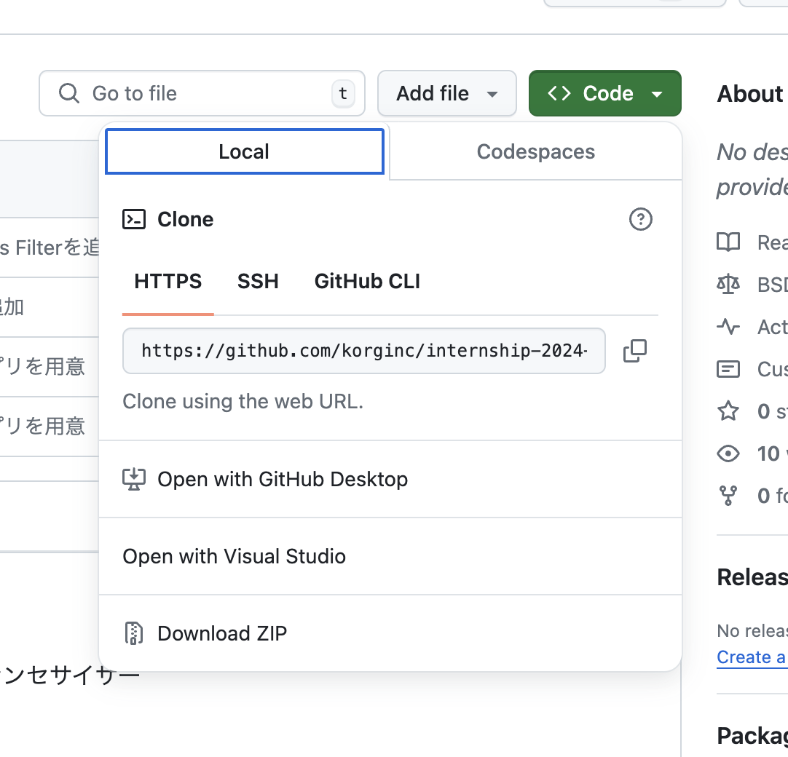

KORG Internship Web Synthesizer

A simple synthesizer that runs in a web browser using JavaScript.

## Development Steps

1. Node.js is required for development, so follow the steps below to install it (skip this step if it's already installed):  
https://www.sejuku.net/blog/72545  
Here is a helpful article about what Node.js is:  
https://qiita.com/non_cal/items/a8fee0b7ad96e67713eb

2. Download the project files.  
If you have a GitHub account, clone this repository to your local machine.  
Otherwise, click the <span style="color: green;"><>Code</span> button in the top right corner, select "Download ZIP," extract the folder, and place it somewhere convenient.  


3. Use the following commands in the command line tool:

```
cd ~~~/internship-2024-summer/app　     // Move to the project folder 
npm ci　　　　　　　　　　　　　　　　　　    //Automatically install the necessary Node.js packages  
npm run dev 　　　　　　　　　　　　　　     //Start the local environment on localhost
```


4. Once the following result is displayed, access the page by visiting http://localhost:~~~~/ from a browser like Chrome.

```
> test@0.0.0 dev
> vite


  VITE v5.3.5  ready in 181 ms

  ➜  Local:   http://localhost:~~~~/
  ➜  Network: use --host to expose
  ➜  press h + enter to show help
```


5. When you edit and save the implementation files, the page will automatically refresh (although a manual page reload may be required sometimes).  
You can check error logs using the browser’s developer tools.

## Project Overview

Folder structure:

```
app
├── index.html
├── node_modules/
├── package-lock.json
├── package.json
├── public/
│   ├── SynthesizerWorklet.js   //Audio signal processing for synthesizer (Osc, Amp, Filter, etc.) 
│   └── vite.svg
├── src/
│   ├── .DS_Store
│   ├── App.vue                 //Main application
│   ├── assets/                 //For storing image data
│   │   └──  korg.jpg
│   ├── components/            
│   │   ├── AmpUI.vue           //UI for Amp section
│   │   ├── FilterUI.vue        //UI for Filter section
│   │   ├── OscillatorUI.vue    //UI for Oscillator section
│   │   └── WaveDisplay.vue     //UI for waveform display
│   ├── main.js
│   └── style.css               //Styles
└── vite.config.js
```


This web application is built using a JavaScript framework called Vue.  
For a better understanding of the benefits of using Vue, refer to this article:  
https://www.webstaff.jp/guide/trend/webit/vuejs/  
*Note that Vue3 has two writing styles, and currently, the Composition API is more commonly used. However, this app is written using the Options API, which was more common in Vue2. Therefore, if you want to look up how to write the code, articles on Vue2 might be easier to understand.

Most of the files you'll be working on will be the ones mentioned above with comments.  
Here’s an explanation of the key files:

### App.vue
This is the main implementation file of the app.

A Vue file generally consists of three sections:

- `template` tag: Embeds HTML elements
- `script` tag: Contains JavaScript code
- `style` tag: Contains CSS styles

These three sections together create a component, and combining such components builds a full web page in Vue.js.

The UI for each section of the synthesizer is implemented as independent child components in the `components/~.vue` files, which are then imported into App.vue (the parent component).  
Additionally, App.vue handles the creation of AudioWorklet and the passing of parameters from the UI components to the AudioWorklet.  
AudioWorklet is part of the Web Audio API, providing low-latency audio processing using a worker thread separate from the main thread.  
This web synthesizer uses AudioWorklet for signal processing, and its implementation can be found in `SynthesizerWorklet.js`.

### parameterDescriptor.js
This file defines the parameters for the synthesizer.

- `parameters`:  
  This object contains all the necessary parameter information, which can be referenced by UI components and the AudioWorklet. If you want to add new parameters, you can do so here.

### SynthesizerWorklet.js
This file contains the implementation of the AudioWorklet, which handles the signal processing for the synthesizer.
The actual processing is written in the `process` function.

#### `process(inputs, outputs, parameters)` {// DSP of the synthesizer }
- `inputs`:  
  An array of input signals. Since this synthesizer has no audio input, this is not used.

- `outputs`:  
  An array of output signals. By filling this array with waveform values, Web Audio can produce sound.  
  It’s a three-dimensional array representing channel count x (stereo, mono, etc.) x sample count, but this synthesizer outputs only a mono signal through `outputs[0][0]`.  
  Typically, a buffer of 128 samples (an array of 128 elements) is provided for each frame of processing.

- `parameters`:  
  Although parameters are usually updated via the `onmessage` function, we don't use this directly in this case.

### style.css
CSS for styling the web page.  
While you can write styles individually in component files, you can also specify common styles here if needed.  
More about CSS: https://schoo.jp/matome/article/1676

## Passing Parameters (UI -> DSP)
Parameters changed in each section's UI are passed through App.vue to the AudioWorklet.

### UI -> App
In Vue, you can use `$emit` to trigger an event in the parent component (App.vue) from a child component (each `UI.vue`).  
By passing arguments, you can send parameters from the UI to App.vue.

// ~UI.vue emits:　　
["parameterChanged"], . . methods:{ uiParameterChanged{ const value = 100 this.$emit("parameterChanged", value) } }

```
//  ~UI.vue
emits: ["parameterChanged"],
.
.
methods:{
  uiParameterChanged{
    const value = 100
    this.$emit("parameterChanged", value)
  }
}

//  App.vue
<~~~UI @parameterChanged="onParameterChanged" />
.
.
methods:{
  onParameterChanged(value){
    console.log(value)  // -> 100
  }
}
```


To pass data from the parent to the child, use the `props` feature.  
Example of props and emit usage: https://qiita.com/d0ne1s/items/f88ecd6aaa90c7bbc5d4

### App -> DSP
There are two methods to pass parameters to the AudioWorklet: using the `parameters` argument in the `process` function or using the `MessagePort`. In this case, we use the latter.  
When `postMessage` is called in App.vue, the `onmessage` handler defined in the AudioWorklet’s constructor is executed to pass the data.

```
//  App.vue
const data = 100
AudioWorklet.port.postMessage(data)

//  AudioWorklet.js
constructor(options) {
  this.port.onmessage = (event) => {
    console.log(event.data);  //  -> 100
  }
}
```

